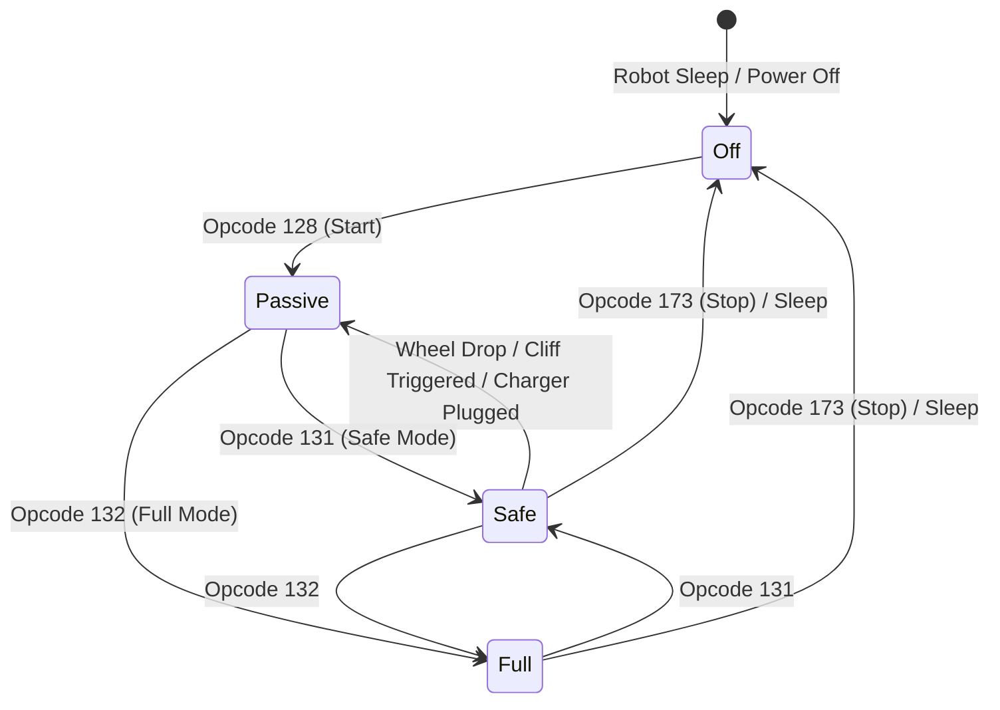

# iRobot Roomba 960 Hardware & Open Interface Manual

Comprehensive technical documentation for interfacing with the **iRobot Roomba 960** via its motherboard micro-USB port using Python, `pyserial-asyncio`, and the iRobot Roomba Open Interface (OI) protocol.

---

## Table of Contents
1. [Hardware Interface & Connection](#1-hardware-interface--connection)
2. [Open Interface (OI) Protocol Specification](#2-open-interface-oi-protocol-specification)
3. [Sensor Architecture & Packet 100 Reference](#3-sensor-architecture--packet-100-reference)
4. [Software Architecture & Modules](#4-software-architecture--modules)
5. [User Scripts & Tools Guide](#5-user-scripts--tools-guide)
6. [Developer API Guide & Code Examples](#6-developer-api-guide--code-examples)
7. [Troubleshooting & Common Issues](#7-troubleshooting--common-issues)
8. [The vSLAM Camera & Vision Subsystem](#8-the-vslam-camera--vision-subsystem)
9. [Audio & Microphone Hardware Capabilities](#9-audio--microphone-hardware-capabilities)

---

## 1. Hardware Interface & Connection

### Physical Port
The Roomba 960 (and 980) contains an internal **micro-USB port** located directly on the main motherboard (underneath the removable top decorative cover / faceplate). Unlike older Roombas (500-800 series) which featured an external 7-pin mini-DIN serial connector, the 900 series exposes serial communication over this micro-USB connection.

### USB Device Enumeration
When connected to a host computer via micro-USB while the Roomba is powered on, the onboard USB-to-UART bridge enumerates as a standard USB CDC ACM (Communication Device Class) serial device:
- **Vendor ID (VID):** `0x27A6` (iRobot Corporation)
- **Product ID (PID):** `0x0002`
- **Windows Device Name:** `USB Serial Device (COMx)` (e.g. `COM11`)
- **Linux Device Node:** `/dev/ttyACM0` or `/dev/ttyUSB0`

### Serial Bus Configuration
| Parameter | Value | Notes |
| :--- | :--- | :--- |
| **Baud Rate** | `115200` | Standard default rate for Roomba OI v2 |
| **Data Bits** | `8` | Standard byte length |
| **Parity** | `None` (`N`) | No parity bit |
| **Stop Bits** | `1` | Single stop bit |
| **Flow Control**| `None` | No RTS/CTS or XON/XOFF hardware handshaking |

---

## 2. Open Interface (OI) Protocol Specification

The Roomba Open Interface protocol operates entirely over raw binary byte sequences sent to and received from the serial port.

### Mode Hierarchy
The Roomba OI operates in four distinct states:



1. **Off Mode:** Serial port may be connected, but OI processor is asleep or inactive.
2. **Passive Mode (Opcode `128`):**
   - Robot responds to sensor query commands (`142`, `148`, `149`).
   - Actuators (drive wheels, brushes, vacuum) cannot be controlled.
3. **Safe Mode (Opcode `131`):**
   - Full control of actuators, drive motors, LEDs, and speaker.
   - **Safety Interlocks Active:** If a cliff is detected, a wheel drops (e.g. robot is lifted), or an internal charger is plugged in, the Roomba immediately stops the drive motors and reverts to **Passive Mode** to prevent damage or falls.
4. **Full Mode (Opcode `132`):**
   - Unrestricted actuator control.
   - Safety interlocks are bypassed (motors continue driving even if cliff or wheel drop sensors are triggered). **Use for workbench testing with wheels elevated.**

### Primary Command Opcodes
| Opcode | Hex | Name | Data Bytes | Description |
| :--- | :--- | :--- | :--- | :--- |
| **`128`** | `0x80` | `START` | None | Initializes Open Interface. Switches mode to Passive. |
| **`129`** | `0x81` | `BAUD` | 1 byte (baud code) | Configures serial baud rate. |
| **`131`** | `0x83` | `SAFE` | None | Enters Safe Mode (safety stops enabled). |
| **`132`** | `0x84` | `FULL` | None | Enters Full Mode (unrestricted motor control). |
| **`133`** | `0x85` | `POWER` | None | Powers down the Roomba. |
| **`135`** | `0x87` | `CLEAN` | None | Starts default autonomous cleaning cycle. |
| **`137`** | `0x89` | `DRIVE` | 4 bytes (`Velocity`, `Radius`) | Drives at specified speed and turn radius. |
| **`138`** | `0x8A` | `MOTORS` | 1 byte (bitmask) | Controls vacuum motor, main brush, and side brush. |
| **`139`** | `0x8B` | `LEDS` | 3 bytes | Controls Clean/Spot/Dock/Warning LED indicators. |
| **`140`** | `0x8C` | `SONG` | Variable | Defines a custom MIDI song sequence in memory. |
| **`141`** | `0x8D` | `PLAY` | 1 byte (`Song Number`) | Plays a previously defined song. |
| **`142`** | `0x8E` | `SENSORS` | 1 byte (`Packet ID`) | Requests an immediate sensor packet response. |
| **`143`** | `0x8F` | `SEEK_DOCK` | None | Commands the robot to seek its Home Base dock. |
| **`145`** | `0x91` | `DRIVE_DIRECT` | 4 bytes (`Right Vel`, `Left Vel`) | Sets individual wheel speeds (-500 to +500 mm/s). |
| **`146`** | `0x92` | `DRIVE_PWM` | 4 bytes (`Right PWM`, `Left PWM`) | Sets raw motor PWM duty cycle (-255 to +255). |
| **`148`** | `0x94` | `STREAM` | N bytes (`Count`, `ID_1`, `ID_2`...)| Starts continuous 15 ms sensor streaming. |
| **`149`** | `0x95` | `QUERY_LIST`| N bytes (`Count`, `ID_1`, `ID_2`...)| Queries a list of specified sensor packets. |
| **`150`** | `0x96` | `PAUSE_STREAM`| 1 byte (`0` or `1`) | Pauses (`0`) or resumes (`1`) sensor streaming. |
| **`173`** | `0xAD` | `STOP` | None | Terminates OI mode and resets to default behavior. |

### Drive Direct (Opcode 145) Payload Format
Commanding `DRIVE_DIRECT` requires exactly 5 bytes:
```text
[ 0x91 ] [ Right Vel High ] [ Right Vel Low ] [ Left Vel High ] [ Left Vel Low ]
```
- Velocities are signed 16-bit integers (`int16`, big-endian, two's complement).
- Valid velocity range: **`-500` to `+500` mm/s**.
- Positive values drive wheel forward; negative values drive wheel in reverse.
- Python packing: `struct.pack(">Bhh", 145, right_speed, left_speed)`

---

## 3. Sensor Architecture & Packet 100 Reference

### Atomic Snapshot: Packet ID 100
Requesting Packet ID `100` (`[142, 100]`) causes the Roomba to return an **atomic 80-byte binary stream** containing all standard sensor packets (Packets 7 through 58). 

Using Packet 100 eliminates sensor polling skew and reduces communication overhead from dozens of individual requests down to a single 80-byte transfer taking only ~7ms at 115200 baud.

### Full 80-Byte Memory Layout

Python unpacking format string:
```python
PACKET_100_STRUCT_FMT = ">BBBBBBBBBB BBhh BhhBhH HHHHHBHB BBBBhhhh HHBHHHHHHhhhhBBB"
```

| Offset | Packet ID | Field Name | Data Type | Units / Range | Description |
| :---: | :---: | :--- | :---: | :---: | :--- |
| **0** | 7 | `bumps_wheel_drops` | `uint8` | Bitmask | Bit 0: Bump Right<br>Bit 1: Bump Left<br>Bit 2: Wheel Drop Right<br>Bit 3: Wheel Drop Left |
| **1** | 8 | `wall` | `uint8` | `0` or `1` | Right Wall optical sensor |
| **2** | 9 | `cliff_left` | `uint8` | `0` or `1` | Floor dropped on far left |
| **3** | 10 | `cliff_front_left` | `uint8` | `0` or `1` | Floor dropped on front left |
| **4** | 11 | `cliff_front_right` | `uint8` | `0` or `1` | Floor dropped on front right |
| **5** | 12 | `cliff_right` | `uint8` | `0` or `1` | Floor dropped on far right |
| **6** | 13 | `virtual_wall` | `uint8` | `0` or `1` | Virtual Wall or Dock beacon detected |
| **7** | 14 | `wheel_overcurrents` | `uint8` | Bitmask | Bit 0: Side Brush<br>Bit 2: Main Brush<br>Bit 3: Right Wheel<br>Bit 4: Left Wheel |
| **8** | 15 | `dirt_detect` | `uint8` | `0 - 255` | Piezoelectric / optical dirt sensor |
| **9** | 16 | *Unused* | `uint8` | - | Reserved / legacy |
| **10** | 17 | `ir_char_omni` | `uint8` | `0 - 255` | Infrared beacon byte from Dock / Remote |
| **11** | 18 | `buttons` | `uint8` | Bitmask | Bit 0: Clean<br>Bit 1: Spot<br>Bit 2: Dock<br>Bit 3: Minute<br>Bit 4: Hour<br>Bit 5: Day<br>Bit 6: Schedule<br>Bit 7: Clock |
| **12-13**| 19 | `distance` | `int16` | mm | Cumulative distance traveled since last query |
| **14-15**| 20 | `angle` | `int16` | degrees | Cumulative rotation angle since last query |
| **16** | 21 | `charging_state` | `uint8` | `0 - 5` | 0: Not Charging<br>1: Reconditioning<br>2: Full Charging<br>3: Trickle Charging<br>4: Waiting<br>5: Charging Fault |
| **17-18**| 22 | `voltage` | `uint16` | mV | Battery terminal voltage (e.g. ~16000 mV) |
| **19-20**| 23 | `current` | `int16` | mA | Current flow (+ charging, - discharging) |
| **21** | 24 | `temperature` | `int8` | °C | Battery pack thermistor temperature |
| **22-23**| 25 | `battery_charge` | `uint16` | mAh | Remaining battery capacity |
| **24-25**| 26 | `battery_capacity` | `uint16` | mAh | Estimated full battery capacity |
| **26-27**| 27 | `wall_signal` | `uint16` | `0 - 1023` | Analog intensity of right wall sensor |
| **28-29**| 28 | `cliff_left_signal` | `uint16` | `0 - 4095` | Analog reflection signal of left cliff |
| **30-31**| 29 | `cliff_front_left_sig` | `uint16`| `0 - 4095` | Analog reflection signal of front-left cliff |
| **32-33**| 30 | `cliff_front_right_sig`| `uint16`| `0 - 4095` | Analog reflection signal of front-right cliff |
| **34-35**| 31 | `cliff_right_signal` | `uint16` | `0 - 4095` | Analog reflection signal of right cliff |
| **36** | 32 | *Unused* | `uint8` | - | Reserved |
| **37-38**| 33 | *Unused* | `uint16` | - | Reserved |
| **39** | 34 | `charging_sources` | `uint8` | Bitmask | Bit 0: Internal Jack<br>Bit 1: Home Base Dock |
| **40** | 35 | `oi_mode` | `uint8` | `0 - 3` | 0: Off, 1: Passive, 2: Safe, 3: Full |
| **41** | 36 | `song_number` | `uint8` | `0 - 4` | Currently selected song number |
| **42** | 37 | `song_playing` | `uint8` | `0` or `1` | Song playback active flag |
| **43** | 38 | `num_stream_packets`| `uint8` | `0 - 255` | Number of streaming packets |
| **44-45**| 39 | `req_velocity` | `int16` | mm/s | Last commanded velocity |
| **46-47**| 40 | `req_radius` | `int16` | mm | Last commanded turn radius |
| **48-49**| 41 | `req_right_velocity` | `int16` | mm/s | Last commanded right wheel speed |
| **50-51**| 42 | `req_left_velocity` | `int16` | mm/s | Last commanded left wheel speed |
| **52-53**| 43 | `left_encoder` | `uint16` | Ticks | Left wheel cumulative encoder counter |
| **54-55**| 44 | `right_encoder` | `uint16` | Ticks | Right wheel cumulative encoder counter |
| **56** | 45 | `light_bumper` | `uint8` | Bitmask | Bit 0: Left<br>Bit 1: Front-Left<br>Bit 2: Center-Left<br>Bit 3: Center-Right<br>Bit 4: Front-Right<br>Bit 5: Right |
| **57-58**| 46 | `light_bump_left_sig` | `uint16` | `0 - 4095` | Light bumper Left analog signal |
| **59-60**| 47 | `light_bump_fl_sig` | `uint16` | `0 - 4095` | Light bumper Front-Left analog signal |
| **61-62**| 48 | `light_bump_cl_sig` | `uint16` | `0 - 4095` | Light bumper Center-Left analog signal |
| **63-64**| 49 | `light_bump_cr_sig` | `uint16` | `0 - 4095` | Light bumper Center-Right analog signal |
| **65-66**| 50 | `light_bump_fr_sig` | `uint16` | `0 - 4095` | Light bumper Front-Right analog signal |
| **67-68**| 51 | `light_bump_right_sig`| `uint16` | `0 - 4095` | Light bumper Right analog signal |
| **69-70**| 52 | `left_motor_current` | `int16` | mA | Left drive motor current draw |
| **71-72**| 53 | `right_motor_current`| `int16` | mA | Right drive motor current draw |
| **73-74**| 54 | `main_brush_current` | `int16` | mA | Main brush motor current draw |
| **75-76**| 55 | `side_brush_current` | `int16` | mA | Side brush motor current draw |
| **77** | 56 | `stasis` | `uint8` | `0` or `1` | Forward progress (0 = slipping/stuck) |
| **78** | 57 | *Unused* | `uint8` | - | Reserved |
| **79** | 58 | *Unused* | `uint8` | - | Reserved |

### Continuous Odometry vs. Packet 19/20 Delta Behavior

#### Why Packet 19 (Distance) & Packet 20 (Angle) Reset to Zero
In the official iRobot Open Interface specification:
- **Packet 19 (`distance`)**: Distance traveled in mm *since the last time distance was requested*.
- **Packet 20 (`angle`)**: Angle turned in degrees *since the last time angle was requested*.

Whenever Packet 100 (or individual packet 19/20) is polled, **the Roomba internal firmware immediately clears these accumulators to 0**. Consequently, when queried continuously (e.g. at 5 Hz), these packets only reflect movement over that single 200 ms slice. The moment the robot stops moving, both values immediately read `0`.

#### The Firmware Angle Truncation Bug
The official iRobot Create 2 Open Interface manual explicitly notes:
> *"Please note that because of the way Roomba calculates angle, the reported angle will have an accumulated error... We recommend using the Wheel Encoders (Packets 43 and 44) to calculate continuous rotation angle instead."*

The internal firmware divides wheel differential by the wheelbase and truncates the quotient to an integer degree on every internal firmware cycle. As a result, slow turns or micro-rotations lose fractional degrees entirely.

#### Persistent Kinematic Odometry from Wheel Encoders (Packet 43 & 44)
To maintain accurate, unbroken position and orientation tracking that never drops to zero when stationary, `RoombaClient` integrates raw optical wheel encoder ticks:
- **Wheel Diameter ($D$):** $72.0\text{ mm}$
- **Wheelbase ($b$):** $235.0\text{ mm}$
- **Encoder Resolution ($N$):** $508.8\text{ ticks per wheel revolution}$
- **Millimeters per Tick:**
  $$\text{mm\_per\_tick} = \frac{\pi \times 72.0}{508.8} \approx 0.444563\text{ mm/tick}$$

#### 16-Bit Unsigned Rollover Handling
Raw encoder ticks from Packets 43 & 44 are 16-bit unsigned integers (`0` to `65535`). When rolling over between $65535 \leftrightarrow 0$, `RoombaClient` computes the signed delta:
$$\Delta \text{ticks} = (\text{curr} - \text{prev} + 32768) \pmod{65536} - 32768$$

The resulting motion increments:
- **Forward displacement:** $\Delta d = \frac{\Delta d_R + \Delta d_L}{2}$
- **Rotation displacement:** $\Delta \theta_{\text{deg}} = \frac{\Delta d_R - \Delta d_L}{235.0} \times \frac{180}{\pi}$
- **Normalized heading:** $\text{heading} = \text{total\_angle} \pmod{360^\circ}$

The web dashboard and telemetry stream expose both the continuous accumulators (`distance_mm`, `angle_deg`, `heading_deg`) and the raw instantaneous slice deltas (`delta_distance_mm`, `delta_angle_deg`). Odometry can be reset to zero at any time via `POST /api/odometry/reset` or the Cockpit UI.

---

## 4. Software Architecture & Modules

The codebase is organized into modular Python components:

```text
d:\ProgramFiles\Projects\random_stuff\
├── roomba_client.py       # Core async library & RoombaSensors model
├── verify_connection.py   # Diagnostics & port verification tool
├── test_move_wheel.py     # Targeted single-wheel motion tester
├── teleop_wasd.py         # Real-time keyboard driver with HUD alerts
├── sensors_monitor.py     # Live sensor dashboard & snapshot tool
├── README.md              # Project quickstart
└── DOCUMENTATION.md       # Complete technical manual (this document)
```

### `roomba_client.py` Component Architecture

- **`RoombaOpcode`**: Constant namespace of all supported Open Interface command opcodes.
- **`RoombaSensorPacket`**: Tuple definitions mapping packet IDs to byte lengths.
- **`RoombaSensors`**: Strongly typed `@dataclass` holding all unpacked sensor attributes with helper methods:
  - `RoombaSensors.from_bytes(raw: bytes) -> RoombaSensors`: Decodes the 80-byte binary packet.
  - `to_dict() -> Dict[str, Any]`: Serializes data to dictionary format.
- **`find_roomba_port() -> Optional[str]`**: Scans system serial ports matching iRobot Vendor ID `0x27A6` or `COM11`.
- **`RoombaClient`**: Asynchronous controller utilizing `serial_asyncio`:
  - **Connection Lifecycle:** `connect()`, `disconnect()`, `__aenter__()`, `__aexit__()`.
  - **Mode Control:** `start()`, `safe_mode()`, `full_mode()`, `stop_oi()`.
  - **Motor Movement:** `drive_direct(right, left)`, `move_wheel(...)`, `stop()`.
  - **Telemetry Fetching:** `get_sensors()`, `get_sensors_dict()`, `get_voltage()`, `get_telemetry()`.

---

## 5. User Scripts & Tools Guide

### 1. Connection Verification (`verify_connection.py`)
Scans all COM ports, detects the iRobot USB device, connects at 115200 baud, sends Start and Safe mode commands, and prints an initial health report.

```powershell
python verify_connection.py
```
*Optional Arguments:*
- `--port COM11`: Explicitly override serial port.
- `--baud 115200`: Override baud rate.

---

### 2. Wheel Movement Test (`test_move_wheel.py`)
Gently moves the right wheel forward for a controlled duration and speed, then automatically cuts motor power.

```powershell
# Default: 100 mm/s for 1.0 second in Safe Mode
python test_move_wheel.py

# Custom duration and speed
python test_move_wheel.py --speed 120 --duration 1.5

# For testing while elevated on a workbench/stand:
python test_move_wheel.py --mode full --speed 100 --duration 1.0
```
*Arguments:*
- `--speed <int>`: Velocity in mm/s (`-500` to `500`, default: `100`).
- `--duration <float>`: Active duration in seconds (default: `1.0`).
- `--mode {safe,full}`: Safe Mode (aborts on wheel drop) or Full Mode (unrestricted).

---

### 3. Keyboard Teleoperation (`teleop_wasd.py`)
Allows real-time interactive driving using WASD keyboard controls from the terminal.

```powershell
python teleop_wasd.py
```

*Key Controls:*
- `W`: Drive forward (both wheels forward).
- `S`: Drive reverse (both wheels backward).
- `A`: Spin left in place (right forward, left backward).
- `D`: Spin right in place (left forward, right backward).
- `Space`: Immediate emergency stop.
- `+` / `-`: Increase / decrease speed by 25 mm/s.
- `Q` / `Esc`: Safely halt motors and disconnect.

*Built-in Safety Features:*
- **Dead-Man's Switch Watchdog:** Holding down a key drives continuously; releasing the key cuts motor power within `0.45s` automatically.
- **Real-Time Sensor HUD:** Polls sensors every 250 ms and displays live HUD alerts for `!BUMP!`, `!CLIFF!`, `OBSTACLE NEAR`, and `!WHEEL DROP!`.

---

### 4. Sensor Monitor & Dashboard (`sensors_monitor.py`)
Inspects and visualizes every single sensor on the Roomba 960.

```powershell
# Single-shot report:
python sensors_monitor.py --once

# Continuous 5 Hz live dashboard:
python sensors_monitor.py --rate 5
```

---

## 6. Developer API Guide & Code Examples

### Example 1: Basic Connection & Reading Battery
```python
import asyncio
from roomba_client import RoombaClient

async def main():
    # Automatically discovers port (or pass port="COM11")
    async with RoombaClient() as roomba:
        # Initialize in Safe Mode
        await roomba.safe_mode()

        # Query all sensors in one atomic call
        sensors = await roomba.get_sensors()
        print(f"Battery: {sensors.battery_percent}% ({sensors.voltage_v} V)")
        print(f"Current: {sensors.current_ma} mA")
        print(f"Temp   : {sensors.temperature_c} °C")

asyncio.run(main())
```

### Example 2: Driving and Obstacle Avoidance
```python
import asyncio
from roomba_client import RoombaClient

async def drive_avoid():
    async with RoombaClient() as roomba:
        await roomba.safe_mode()
        print("Driving forward...")

        for _ in range(50):  # Drive loop for 5 seconds
            sensors = await roomba.get_sensors()

            # If bumper is pressed or light bumper detects nearby obstacle:
            if sensors.bump_left or sensors.light_bumper_left:
                print("Obstacle on left! Turning right...")
                await roomba.drive_direct(-100, 100)  # Spin right
                await asyncio.sleep(0.5)
            elif sensors.bump_right or sensors.light_bumper_right:
                print("Obstacle on right! Turning left...")
                await roomba.drive_direct(100, -100)  # Spin left
                await asyncio.sleep(0.5)
            else:
                # Drive forward at 150 mm/s
                await roomba.drive_direct(150, 150)

            await asyncio.sleep(0.1)

        await roomba.stop()
        print("Finished.")

asyncio.run(drive_avoid())
```

### Example 3: Tracking Odometry & Wheel Encoders
```python
import asyncio
from roomba_client import RoombaClient

async def track_movement():
    async with RoombaClient() as roomba:
        await roomba.safe_mode()

        initial_sensors = await roomba.get_sensors()
        init_l = initial_sensors.left_encoder
        init_r = initial_sensors.right_encoder

        # Drive forward for 1 second
        await roomba.move_wheel(right_speed_mm_s=150, left_speed_mm_s=150, duration_s=1.0)

        final_sensors = await roomba.get_sensors()
        delta_l = (final_sensors.left_encoder - init_l) % 65536
        delta_r = (final_sensors.right_encoder - init_r) % 65536

        print(f"Left Encoder Ticks : {delta_l}")
        print(f"Right Encoder Ticks: {delta_r}")

asyncio.run(track_movement())
```

---

## 7. Troubleshooting & Common Issues

### 1. `PermissionError(13, 'Access is denied.', None, 5)`
- **Cause:** On Windows, COM ports are strictly exclusive. Only one process can hold `COM11` open at any given time.
- **Solution:** If a previous run of `teleop_wasd.py` or `sensors_monitor.py` is still running in a background terminal or another window, terminate it or close that window before starting a new script:
  ```powershell
  # Find and kill lingering Python processes holding the port
  Get-Process python | Stop-Process -Force
  ```

### 2. Robot does not move in Safe Mode (`--mode safe`)
- **Cause:** In Safe Mode (`131`), the Roomba's safety interlock will immediately cancel drive commands if any wheel is dropped (elevated) or cliff sensor detects a drop.
- **Solution:**
  - If testing on the floor: Ensure the Roomba is placed on a flat surface so both drive wheels are compressed.
  - If testing on a workbench / elevated stand: Run with `--mode full` (Opcode `132`) which bypasses the wheel-drop interlock.

### 3. Robot does not respond to serial commands
- **Cause:** The Roomba's internal processor may be in sleep mode or battery conservation.
- **Solution:**
  1. Press the physical **CLEAN** button on the Roomba to wake it up.
  2. Verify that the micro-USB cable is securely seated in the motherboard port.
  3. Run `python verify_connection.py` to confirm the serial link.

### 4. Telemetry / Battery Readings Jumping or Corrupted ("All Over the Place")
- **Root Cause (Framing Desync):** Opcode 142 (Sensors) returns raw binary bytes without a start delimiter or checksum. If an action command (like `beep`, `clean`, `spot`, or mode switch) emits extra status bytes, or if a read times out, `asyncio.StreamReader`'s buffer shifts by $N$ bytes. When an 80-byte struct unpack is shifted, every sensor field is read from the wrong offset (e.g. voltage reading as 7 mV, temperature reading as 252 °C, current reading as 17,415 mA).
- **Engineered Fix Applied:**
  1. **Pre-Query Buffer Flush:** Both the OS UART driver and `StreamReader._buffer` are purged immediately before querying sensor packets.
  2. **Physical Invariant Sanity Validation:** `RoombaSensors.from_bytes()` enforces physical bounds ($10.0\text{V} \le V \le 18.5\text{V}$, $-10^\circ\text{C} \le T \le 65^\circ\text{C}$, OI mode $\in \{0,1,2,3\}$). Any shifted packet is immediately caught and rejected before reaching the application.
  3. **Last-Known-Good Fallback Cache:** If a read transiently glitches, the client re-flushes the buffer and serves the last valid verified telemetry snapshot.
  4. **Exponential Moving Average (EMA) Filtering:** Electrical readings apply an EMA filter ($\alpha = 0.25$) to smooth out ADC noise and motor engagement voltage sags.
  5. **Post-Action Flushes:** Buffers are drained after action commands (`clean`, `spot`, `seek_dock`, `beep`) to prevent firmware status text from contaminating the sensor queue.

---

## 8. The vSLAM Camera & Vision Subsystem

### Can the Camera be Accessed via the micro-USB Port?
**No.** It is not possible to stream or capture camera frames through the micro-USB Open Interface (OI) port.

### Technical & Architectural Reasons:

#### 1. Dual-Processor Hardware Architecture
The Roomba 900 series uses two distinct computing systems on the motherboard:
- **Low-Level Microcontroller (MCU - STM32 / ARM Cortex-M):**
  - Physically wired to the micro-USB port, wheel motors, bumpers, cliff IR sensors, encoders, and battery management.
  - Runs the Open Interface (OI) firmware at 115200 baud.
- **High-Level Application Processor (SoC - ARM Linux):**
  - Runs embedded Linux with core daemon processes (`cleantrack` for navigation, `connectivity_manager` for Wi-Fi / MQTT).
  - The camera is physically wired directly to this Linux SoC via a high-speed parallel / MIPI CSI ribbon cable.
  - The low-level MCU has **zero physical connection** to the camera data lines.

#### 2. Serial Bandwidth Constraints
The micro-USB port operates over a 115200 baud UART link (~11.5 KB/s). Even a single uncompressed low-resolution frame (e.g. 640x480 grayscale = 300 KB) would take over **25 seconds** to transmit across this serial connection, making video transmission physically impossible over the OI interface.

#### 3. Protocol Limitations
The iRobot Open Interface (OI) specification contains no opcodes or packet structures for video streaming or image frames. It is exclusively an actuator control and low-speed sensor protocol.

---

### How the Camera Works Inside the Roomba 960:
- **Sensor Type:** Upward-angled (~30° to 45°) low-resolution grayscale CMOS optical sensor aimed at the ceiling, doorframes, and walls.
- **vSLAM (Visual Simultaneous Localization and Mapping):**
  - Used strictly for **iAdapt 2.0 Navigation**.
  - The proprietary `cleantrack` process extracts sparse visual contrast points (corners, light fixtures, door headers) from each frame in volatile RAM to estimate robot position and drift.
  - **Privacy Architecture:** Raw image frames are discarded immediately after feature extraction. Neither iRobot's official mobile app, nor their AWS cloud servers, nor local LAN MQTT APIs (`dorita980`) receive or store video streams.

---

### Recommended Alternatives for Vision in Robotics:
If your robotics project requires computer vision (e.g. object detection, OpenCV, SLAM, AprilTags):
1. **Mount an External Camera:** Mount a USB webcam, Raspberry Pi Camera, or Intel RealSense depth camera on top of the Roomba's flat chassis.
2. **Onboard Single-Board Computer (SBC):** Connect the Roomba's micro-USB cable to a Raspberry Pi 4/5 or Jetson Nano mounted on the robot:
   - The SBC runs `roomba_client.py` over serial for motor driving and wheel odometry.
   - The SBC runs OpenCV or ROS / ROS 2 using its own dedicated camera for computer vision.

---

## 9. Audio & Microphone Hardware Capabilities

### Does the Roomba 960 Have a Microphone?
**No. The iRobot Roomba 960 does NOT have an onboard microphone.**

#### Technical Clarification:
- **No Physical Audio Input:** There is no microphone transducer, MEMS microphone, audio ADC, or analog input circuitry anywhere on the Roomba 960 motherboard or outer body.
- **Why Users Often Assume It Has One:**
  - The Roomba 960 integrates with **Amazon Alexa** and **Google Assistant**. Voice recognition is executed 100% on external smart speakers (Echo, Nest) or smartphones, which communicate through iRobot's cloud API. The robot receives only digital cleaning/docking commands over Wi-Fi.
  - The Roomba 960 features voice error prompts (e.g. *"Please charge Roomba"*, *"Error 14"*), which gives the impression of a two-way audio device.
- **Adding Audio Input to Your Robot:**
  If your project requires acoustic input (speech commands, voice recognition, or sound direction detection):
  - Connect a standard **USB mini-microphone** or conference array to the host PC or onboard Single-Board Computer (Raspberry Pi 4/5 / Jetson Nano).
  - Use Python libraries like `speech_recognition`, `sounddevice`, or `whisper` to process audio from the USB mic.

---

### The Onboard Speaker & Sound Transmission

#### Speaker Hardware Specifications
- **Transducer:** 16 Ohm, 1 Watt dynamic speaker (~35.8 mm diameter).
- **Physical Location:** Bottom chassis near the drive wheel and motherboard cavity.
- **Driver Circuitry:** Connected directly to the low-level MCU PWM/timer tone generator.

#### Open Interface (OI) Sound Protocol
Over the micro-USB serial link (115200 baud), the Roomba OI exposes two commands for sound:

| Opcode | Name | Payload | Description |
| :--- | :--- | :--- | :--- |
| **`140`** (`0x8C`) | `SONG` | `[140, song_num, length, note1, dur1, ...]` | Defines a sequence of up to 16 notes in memory slot 0–4 (or 0–15). |
| **`141`** (`0x8D`) | `PLAY` | `[141, song_num]` | Triggers playback of the specified song slot. |

#### Notes & Durations Format:
- **Pitch:** MIDI Note number **`31` to `127`** (~49 Hz to 12.5 kHz).
  - **Musical Rests:** Note number **`0`** (or any value `< 31`) is natively treated as **silence/rest** for the duration.
- **Duration:** Integer **`1` to `255`** in increments of **1/64th second** (e.g., `64` = 1.0s, `32` = 0.5s, `16` = 0.25s).

#### What the Internal Speaker CAN Do:
1. **Melodies & Songs:** Play musical compositions by chunking notes into 16-note batches and sequencing them (`client.play_tune(notes)`).
2. **Preset Tunes:** Built-in library including Super Mario Bros, Star Wars Imperial March, Stadium Charge, Zelda Secret Chime, Alert Sirens, and R2-D2 chirps.
3. **Nokia RTTTL Ringtones:** Full parser support (`client.rtttl_to_notes()`) allowing thousands of standard open-source ringtones to be transmitted to the robot.
4. **Morse Code Audio Transmission:** Converts any text string into International Morse Code audio beeps (`client.text_to_morse_notes("SOS")`).

#### What the Internal Speaker CANNOT Do (and Workarounds):
- **No Raw PCM / MP3 / WAV Voice Streaming:** The MCU drives the speaker via a square-wave tone generator. The 115200 baud serial connection has no DAC or audio streaming endpoint.
- **For High-Fidelity Voice / Speech / MP3 Playback:**
  - **Onboard Bluetooth / USB Speaker:** Mount a compact USB or Bluetooth speaker on the Roomba's top plate connected to the host PC or SBC.
  - **Web Audio Cockpit Bridge:** Stream speech synthesis or audio effects in the browser dashboard in real time alongside robot commands.


